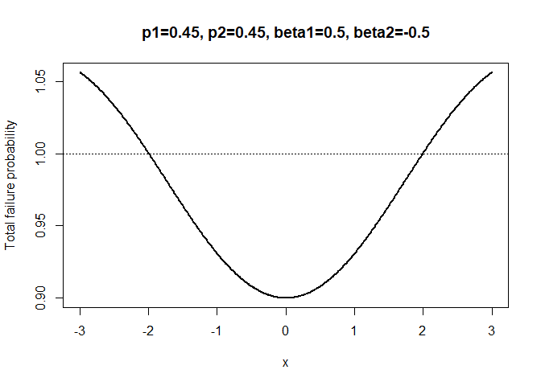
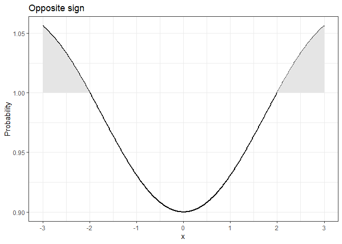
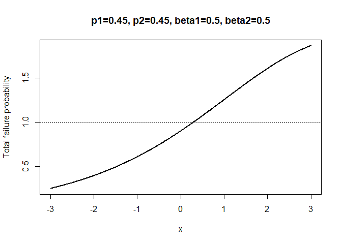
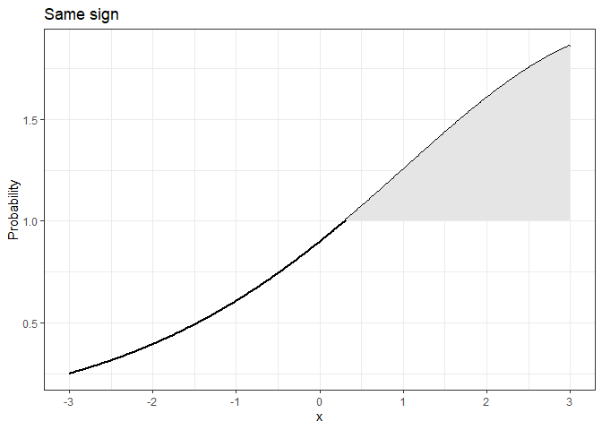
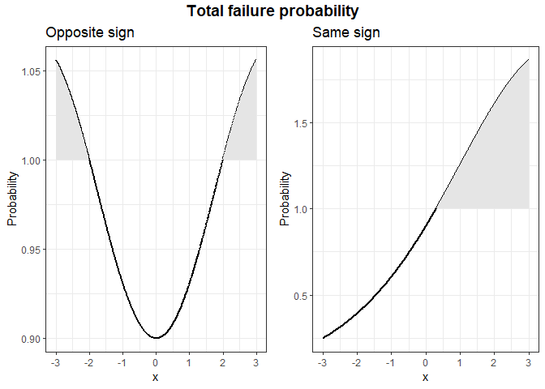
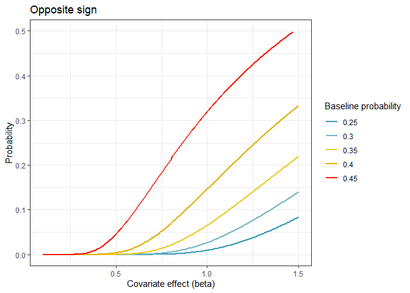
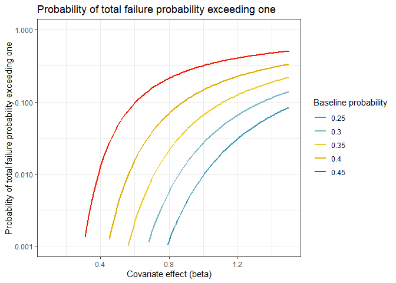
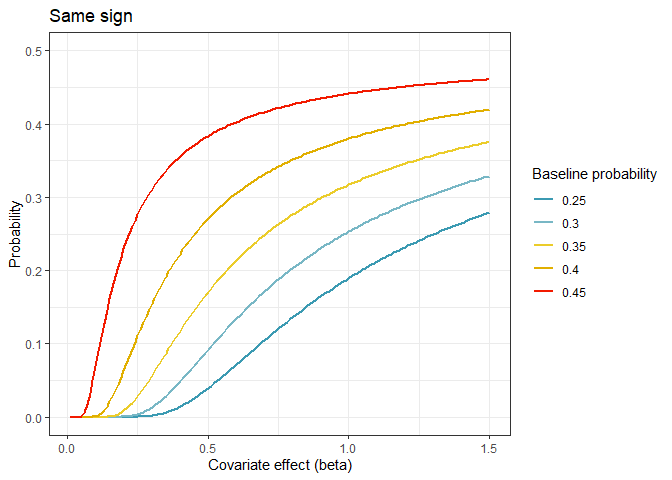
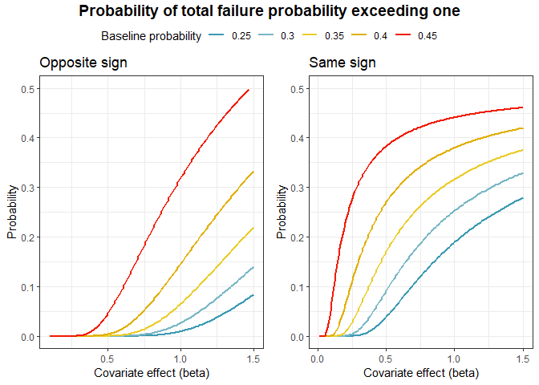

Introduction
============

The purpose of this document is to study the extent of the problem of
the total failure probability exceeding one, when Fine-Gray models are
fitted for all causes. We restrict attention here to the case of two
causes of failure and a single covariate *x* which has has a standard
normal distribution.

The problem of the total failure probability exceeding one
==========================================================

We start from two proportional subdistribution models, given by
*F*<sub>1</sub>(*t* \| *x*) = 1 − (1 − *F*<sub>10</sub>(*t*))<sup>*γ*<sub>1</sub>(*x*)</sup>,  *F*<sub>2</sub>(*t* \| *x*) = 1 − (1 − *F*<sub>20</sub>(*t*))<sup>*γ*<sub>2</sub>(*x*)</sup>,
where *F*<sub>10</sub>(*t*) and *F*<sub>20</sub>(*t*) are the baseline
cumulative incidences of cause 1 and 2, respectively, corresponding to
*x* = 0, and *γ*<sub>1</sub>(*x*) = *e*<sup>*β*<sub>1</sub>*x*</sup> and
*γ*<sub>2</sub>(*x*) = *e*<sup>*β*<sub>2</sub>*x*</sup> are the
subdistribution hazard ratios for *x* of cause 1 and cause 2,
respectively.

Fix a time point *t*, and define *p*<sub>1</sub> = *F*<sub>10</sub>(*t*)
and *p*<sub>2</sub> = *F*<sub>20</sub>(*t*). Then the total failure
probability is given by
TFP(*x*) = *F*<sub>1</sub>(*t* \| *x*) + *F*<sub>2</sub>(*t* \| *x*) = 1 − (1 − *p*<sub>1</sub>)<sup>*γ*<sub>1</sub>(*x*)</sup> + 1 − (1 − *p*<sub>2</sub>)<sup>*γ*<sub>2</sub>(*x*)</sup>.
What I will do in the remainder of this document is see, for given
baseline cumulative incidence values at time *t*, *p*<sub>1</sub> and
*p*<sub>2</sub>, and for given *β*<sub>1</sub> and *β*<sub>2</sub>, what
values of *x* will result in non-admissible TFP(*x*) \> 1. After
determining what values of *x* result in non-admissible TFP(*x*) \> 1,
we can quantify the probability that this happens (knowing *X* comes
from a standard normal distribution). Intuition says that TFP(*x*) \> 1
will happen more frequently for higher *p*<sub>1</sub> and
*p*<sub>2</sub>, and for larger (in absolute value) *β*<sub>1</sub> and
*β*<sub>2</sub>.

I will start by defining the function `TFP`, and making a plot of
TFP(*x*) against *x*, for *p*<sub>1</sub> = *p*<sub>2</sub> = 0.45, and
*β*<sub>1</sub> =  − *β*<sub>2</sub> = 0.5, reasonably close to the
simulation earlier, for *t* = 20.

``` r
TFP <- function(x, p1, p2, beta1, beta2) 
  1 - (1-p1)^(exp(beta1*x)) + 1 - (1-p2)^(exp(beta2*x))
xseq <- seq(-3, 3, by=0.01)
p1 <- 0.45; p2 <- 0.45
beta1 <- 0.5; beta2 <- -0.5
plot(xseq, TFP(xseq, p1=p1, p2=p2, beta1=beta1, beta2=beta2), type="l", lwd=2,
     xlab="x", ylab="Total failure probability")
abline(h=1, lty=3)
title(main="p1=0.45, p2=0.45, beta1=0.5, beta2=-0.5")
```



We can find the points where TFP(*x*) crosses 1 by applying the function
`uniroot`.

``` r
TFPmin1 <- function(x, p1, p2, beta1, beta2) 
  1 - (1-p1)^(exp(beta1*x)) + 1 - (1-p2)^(exp(beta2*x)) - 1
# Positive x
TFPplus <- uniroot(TFPmin1, c(0, 10), p1=p1, p2=p2, beta1=beta1, beta2=beta2)$root
TFPplus
```

    ## [1] 1.992583

``` r
# Negative x
TFPmin <- uniroot(TFPmin1, c(-10, 0), p1=p1, p2=p2, beta1=beta1, beta2=beta2)$root
TFPmin
```

    ## [1] -1.992583

Let’s go for a ggplot version of this.

``` r
library(ggplot2)
library(tidyverse)
```

    ## -- Attaching packages --------------------------------------- tidyverse 1.3.0 --

    ## v tibble  3.0.1     v dplyr   1.0.0
    ## v tidyr   1.1.0     v stringr 1.4.0
    ## v readr   1.3.1     v forcats 0.5.0
    ## v purrr   0.3.4

    ## -- Conflicts ------------------------------------------ tidyverse_conflicts() --
    ## x dplyr::filter() masks stats::filter()
    ## x dplyr::lag()    masks stats::lag()

``` r
tmp <- tibble(x=xseq, tfp=TFP(xseq, p1=p1, p2=p2, beta1=beta1, beta2=beta2))

ggp1 <- tmp %>%
  ggplot(aes(x = x, y = tfp)) +
  geom_line(size = 1) +
  labs(
    title = "Opposite sign",
    x = "x",
    y = "Probability"
  ) +
  scale_x_continuous(breaks = -3:3) +
  
  # We need two ribbons to avoid line joining them
  geom_ribbon(
    data = tmp %>% filter(tfp >= 1 & x < 0),
    aes(x = x, ymin = 1, ymax = tfp),
    fill = "grey90"
  ) +
  geom_ribbon(
    data = tmp %>% filter(tfp >= 1 & x >= 0),
    aes(x = x, ymin = 1, ymax = tfp),
    fill = "grey90"
  ) + 
  theme_bw()
ggp1
```



The corresponding normal probabilities are given by

``` r
pnorm(TFPplus, lower.tail=FALSE)
```

    ## [1] 0.02315354

``` r
pnorm(TFPmin, lower.tail=TRUE)
```

    ## [1] 0.02315354

The sum of these probabilities, 0.0463071, is the probability of a total
failure probability exceeding one, for the above values of
*p*<sub>1</sub>, *p*<sub>2</sub>, *β*<sub>1</sub> and *β*<sub>2</sub>.

Let’s have a look at *β*<sub>1</sub> = *β*<sub>2</sub> = 0.5.

``` r
xseq <- seq(-3, 3, by=0.01)
p1 <- 0.45; p2 <- 0.45
beta1 <- 0.5; beta2 <- 0.5
plot(xseq, TFP(xseq, p1=p1, p2=p2, beta1=beta1, beta2=beta2), type="l", lwd=2,
     xlab="x", ylab="Total failure probability")
abline(h=1, lty=3)
title(main="p1=0.45, p2=0.45, beta1=0.5, beta2=0.5")
```



``` r
# Positive x
TFPplus <- uniroot(TFPmin1, c(0, 10), p1=p1, p2=p2, beta1=beta1, beta2=beta2)$root
TFPplus
```

    ## [1] 0.2958484

``` r
pnorm(TFPplus, lower.tail=FALSE)
```

    ## [1] 0.3836729

The ggplot version of this plot is now combined with the previous
(opposite sign) ggplot.

``` r
tmp <- tibble(x=xseq, tfp=TFP(xseq, p1=p1, p2=p2, beta1=beta1, beta2=beta2))

ggp2 <- tmp %>%
  ggplot(aes(x = x, y = tfp)) +
  geom_line(size = 1) +
  labs(
    title = "Same sign",
    x = "x",
    y = "Probability"
  ) +
  scale_x_continuous(breaks = -3:3) +
  
  # We need two ribbons to avoid line joining them
  geom_ribbon(
    data = tmp %>% filter(tfp >= 1 & x >= 0),
    aes(x = x, ymin = 1, ymax = tfp),
    fill = "grey90"
  ) + 
  theme_bw()
ggp2
```



``` r
library(ggpubr)
figure <- ggarrange(ggp1, ggp2, common.legend=TRUE)
annfigure <- annotate_figure(figure,
                             top = text_grob("Total failure probability", face = "bold", size = 14))
annfigure
```



``` r
# ggsave("TFPplots.pdf")
```

We can make all this into a function that finds the probability of a
total failure probability exceeding one, for given values of
*p*<sub>1</sub>, *p*<sub>2</sub>, *β*<sub>1</sub> and *β*<sub>2</sub>.

``` r
pTFPexc1 <- function(p1, p2, beta1, beta2, boundary=10) {
  TFPmin1 <- function(x, p1, p2, beta1, beta2) 
    1 - (1-p1)^(exp(beta1*x)) + 1 - (1-p2)^(exp(beta2*x)) - 1
  pTFPplus <- pTFPmin <- 0
  # Find root for positive x, will work unless beta1 and beta2 are both negative
  if (!(beta1<0 & beta2<0)) {
    TFPplus <- uniroot(TFPmin1, c(0, boundary), p1=p1, p2=p2, beta1=beta1, beta2=beta2)$root
    pTFPplus <- pnorm(TFPplus, lower.tail=FALSE)
  }
  # Find root for negative x, will work unless beta1 and beta2 are both positive
  if (!(beta1>0 & beta2>0)) {
    TFPmin <- uniroot(TFPmin1, c(-boundary, 0), p1=p1, p2=p2, beta1=beta1, beta2=beta2)$root
    pTFPmin <- pnorm(TFPmin, lower.tail=TRUE)
  }
  return(pTFPplus + pTFPmin)
}
pTFPexc1(p1=0.45, p2=0.45, beta1=0.5, beta2=-0.5, boundary=10)
```

    ## [1] 0.04630708

We can now check our intuition, which says that TFP(*x*) \> 1 will
happen more frequently for higher *p*<sub>1</sub> and *p*<sub>2</sub>,
and for larger (in absolute value) *β*<sub>1</sub> and *β*<sub>2</sub>.

``` r
pTFPexc1(p1=0.46, p2=0.46, beta1=0.5, beta2=-0.5, boundary=10)
```

    ## [1] 0.07637164

``` r
pTFPexc1(p1=0.45, p2=0.45, beta1=0.6, beta2=-0.6, boundary=10)
```

    ## [1] 0.09681915

So, in a situation where Fine-Gray models have been fitted for cause 1
and cause 2, if the estimated cumulative incidences at some time point
*t* are 0.45 for both causes, and the estimated *β*<sub>1</sub> and
*β*<sub>2</sub> are equal to 0.6 and -0.6, respectively, then for 10% of
the patients the model-based total failure probability (TFP) will exceed
one.

If *β*<sub>1</sub> and *β*<sub>2</sub> have the same sign the
probability of TFP exceeding one is a lot larger for the same
*p*<sub>1</sub> and *p*<sub>2</sub>.

``` r
pTFPexc1(p1=0.45, p2=0.45, beta1=0.5, beta2=0.5, boundary=10)
```

    ## [1] 0.3836729

What is perhaps less obvious is that, while keeping the total baseline
cumulative incidence *p*<sub>1</sub> + *p*<sub>2</sub> constant, and the
total effect size \|*β*<sub>1</sub>\| + \|*β*<sub>2</sub>\| constant,
the case *p*<sub>1</sub> = *p*<sub>2</sub> and
*β*<sub>1</sub> =  − *β*<sub>2</sub> is the most favorable in keeping
the TFP below 1.

``` r
# Base case
pTFPexc1(p1=0.45, p2=0.45, beta1=0.5, beta2=-0.5, boundary=10)
```

    ## [1] 0.04630708

``` r
# Making p1 unequal to p2
pTFPexc1(p1=0.46, p2=0.44, beta1=0.5, beta2=-0.5, boundary=10)
```

    ## [1] 0.04656941

``` r
# Making beta1 unequal to -beta2
pTFPexc1(p1=0.45, p2=0.45, beta1=0.51, beta2=-0.49, boundary=10)
```

    ## [1] 0.04779931

``` r
# Making p1 unequal to p2 and beta1 unequal to -beta2
pTFPexc1(p1=0.46, p2=0.44, beta1=0.51, beta2=-0.49, boundary=10)
```

    ## [1] 0.04940599

In showing that TFP exceeding one is a problem we will therefore
restrict to *p*<sub>1</sub> = *p*<sub>2</sub> and
*β*<sub>1</sub> =  − *β*<sub>2</sub>; changing to $p\_1 \\not= p\_2$ or
$\\beta\_1 \\not= -\\beta\_2$ will increase the probability of TFP
exceeding one, subject to the total baseline cumulative incidence
*p*<sub>1</sub> + *p*<sub>2</sub>, and the total effect size
\|*β*<sub>1</sub>\| + \|*β*<sub>2</sub>\| staying the same. That
simplifies life, because we only have to keep track of two variables,
*p* = *p*<sub>1</sub> = *p*<sub>2</sub> and
*β* = \|*β*<sub>1</sub>\| =  − \|*β*<sub>2</sub>\|.

I will now record the probabilities of TFP exceeding one for a set of
baseline probabilities *p* = 0.25, 0.3, …, 0.45, and a range of *β*
values, ranging from 0.1 to 2, and make a nice plot of it.

``` r
pseq <- seq(0.25, 0.45, by=0.05)
betaseq <- seq(0.1, 1.5, by=0.01)
np <- length(pseq)
nbeta <- length(betaseq)
# Store results in res
res <- matrix(NA, nbeta, np)
for (i in 1:np) {
  p <- pseq[i]
  for (j in 1:nbeta) {
    beta <- betaseq[j]
    boundary <- ifelse(beta>0.3, 10, 100) # trial and error
    res[j, i] <- pTFPexc1(p1=p, p2=p, beta1=beta, beta2=-beta, boundary=boundary)
  }
}
# Prepare for plotting
library(wesanderson)
dfres <- data.frame(beta=rep(betaseq, np), p=rep(pseq, each=nbeta), prob=as.vector(res))
dfres$p <- as.factor(dfres$p)
# Plot
ggp <- ggplot(data = dfres,
              aes(x=beta, y=prob, col=p)) +
  geom_line(size=1) + 
  labs(title = "Opposite sign",
       x = "Covariate effect (beta)",
       y = "Probability") +
  ylim(0, 0.5) + 
  scale_x_continuous(breaks=c(0, 0.5, 1, 1.5)) +
  scale_color_manual(name="Baseline probability", values=wes_palette(n=5, name="Zissou1")) +
  theme_bw()
print(ggp)
```

    ## Warning: Removed 3 row(s) containing missing values (geom_path).



``` r
ggpoppsign <- ggp
```

Here is the same plot, but then with logarithmic scale on the y-axis.

``` r
ggp <- ggplot(data = dfres,
              aes(x=beta, y=prob, col=p)) +
  geom_line(size=1) + 
  labs(title = "Probability of total failure probability exceeding one",
       x = "Covariate effect (beta)",
       y = "Probability of total failure probability exceeding one") +
  scale_color_manual(name="Baseline probability", values=wes_palette(n=5, name="Zissou1")) +
  scale_y_log10(limits=c(0.001, 1)) + 
  theme_bw()
print(ggp)
```

    ## Warning: Removed 229 row(s) containing missing values (geom_path).



It may be interesting to do the same thing, now for *β*<sub>1</sub> and
*β*<sub>2</sub> having the same sign.

``` r
betaseq <- seq(0.01, 1.5, by=0.01)
nbeta <- length(betaseq)
res <- matrix(NA, nbeta, np)
for (i in 1:np) {
  p <- pseq[i]
  for (j in 1:nbeta) {
    beta <- betaseq[j]
    boundary <- ifelse(beta>0.3, 10, 100) # trial and error
    res[j, i] <- pTFPexc1(p1=p, p2=p, beta1=beta, beta2=beta, boundary=boundary)
  }
}
dfres <- data.frame(beta=rep(betaseq, np), p=rep(pseq, each=nbeta), prob=as.vector(res))
dfres$p <- as.factor(dfres$p)
# Plot
ggp <- ggplot(data = dfres,
              aes(x=beta, y=prob, col=p)) +
  geom_line(size=1) + 
  labs(title = "Same sign",
       x = "Covariate effect (beta)",
       y = "Probability") +
  ylim(0, 0.5) + 
  scale_x_continuous(breaks=c(0, 0.5, 1, 1.5)) +
  scale_color_manual(name="Baseline probability", values=wes_palette(n=5, name="Zissou1")) +
  theme_bw()
print(ggp)
```



``` r
ggpsamesign <- ggp

figure <- ggarrange(ggpoppsign, ggpsamesign, common.legend=TRUE)
```

    ## Warning: Removed 3 row(s) containing missing values (geom_path).

    ## Warning: Removed 3 row(s) containing missing values (geom_path).

``` r
annfigure <- annotate_figure(figure,
                             top = text_grob("Probability of total failure probability exceeding one", face = "bold", size = 14))
annfigure
```



``` r
# ggsave("TFPexc1plots.pdf")
```
